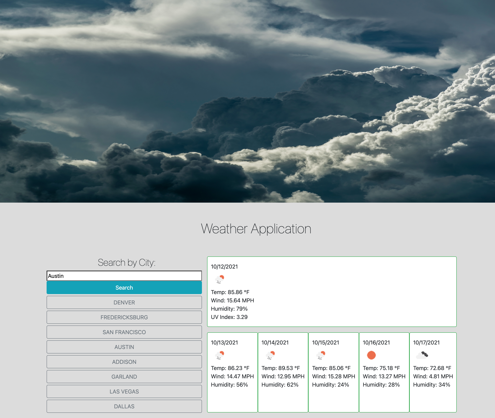

# WeatherApp
AS A traveler
I WANT to see the weather outlook for multiple cities
SO THAT I can plan a trip accordingly

# Criteria

- Given the traveler opens the weather dashboard, they are presented with a form input.

- Traveler can search for a city, then is presented with current and future conditions for that city. The city is then added to the search history.

- The traveler is presented with the city name, date, and icons that represent the weather conditions, themperature, humidity, wind speed and the UVI.

- When the traveler views the UVI, they are presented with a color that indicates weather conditions are favorable, moderate, or severe.

- The traveler is also presented with a 5-day forecast for that city which displays the date, as well as, icons to represent the temperature, wind speed and humidity. 

- When the traveler clicks on a city in the search history they are presented again with the current and future weather conditions for that city.

# Screenshot

# Deployed Site 

[Link to Project on GitHub Pages ](https://mlh19.github.io/WeatherApp/)

# Other

- Worked on this project with peers Damien Luzzo and Todd Taylor. As well as a tutor outside the program. 
- Resources for this application include:
    - https://www.pexels.com/photo/beautiful-clouds-cloudy-dramatic-209831/
    - https://openweathermap.org/api
    - https://getbootstrap.com/
    -